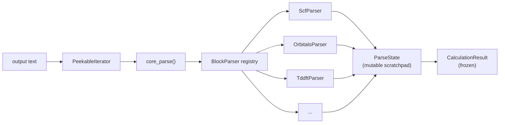

# Concepts

CalcFlow is built around three ideas: *immutability*, *composition*, and *separation of concerns*.

## Immutable Data Models

All data models are standard-library `dataclasses` with `frozen=True`. Once created, no field can be changed. To "modify" a spec you call a setter that returns a new instance via `dataclasses.replace()`.

```python
calc = CalculationInput(charge=0, spin_multiplicity=1, task="energy",
                        level_of_theory="B3LYP", basis_set="def2-SVP")

calc_tddft = calc.set_tddft(nroots=5, singlets=True, triplets=False)

assert calc.tddft is None
assert calc_tddft.tddft is not None
```

Branching a spec is cheap and safe:

```python
base = CalculationInput(charge=0, spin_multiplicity=1, task="energy",
                        level_of_theory="wB97X-D3", basis_set="def2-TZVP")

in_vacuum  = base
in_solvent = base.set_solvation(model="smd", solvent="water")
with_tddft = base.set_tddft(nroots=10, singlets=True, triplets=False)
```

All three share the same immutable base — no risk of one accidentally affecting another.

## The Parser Architecture

An output file is a sequence of *blocks*, each with a distinctive header, a specific format, and a well-defined set of data. CalcFlow uses the **strategy pattern**: a registry of `BlockParser` objects, each responsible for one block type.



**`core_parse()`** iterates lines and for each line asks every registered `BlockParser` whether it handles that line.

**`BlockParser`** has two methods: `matches(line, state)` — a fast, stateless check — and `parse(iterator, start_line, state)` — which consumes lines and writes into state.

**`ParseState`** is the single mutable scratchpad all parsers write into. When parsing is complete it's converted to an immutable `CalculationResult`.

Adding support for a new output block means writing one new `BlockParser` class and registering it. The core engine and every other parser are untouched.

See [Writing Block Parsers](developers/parsers.md) for the full recipe.

## The Fluent Input API

`CalculationInput` describes *what* you want — method, basis, task, solvation, excited states — and program-specific builders translate that into valid input syntax for Q-Chem or ORCA.

```python
calc = (
    CalculationInput(
        charge=0,
        spin_multiplicity=1,
        task="geometry",
        level_of_theory="PBE0",
        basis_set="def2-TZVP",
    )
    .set_optimization(calc_hess_initial=True)
    .run_frequency_after_opt()
    .set_solvation(model="cpcm", solvent="acetonitrile")
    .set_cores(16)
)

qchem = calc.export("qchem", geom)
orca  = calc.export("orca", geom)
```

Validation happens at construction time — incompatible settings raise immediately, not when the job is submitted.

## Zero Dependencies

The core `calcflow` package has no runtime dependencies. This is intentional — a library for I/O should be installable anywhere: HPC clusters, CI containers, scripts running alongside QC programs. A hard numpy dependency would break that.

Spectrum broadening (`postprocess`) requires numpy, gated behind an optional extra:

```bash
pip install "calcflow[numpy]"
```

## Self-Documenting API

Both `CalculationInput` and `CalculationResult` expose a runtime API reference generated from the source code:

```python
print(CalculationInput.get_api_docs())

from calcflow.common.results import CalculationResult
print(CalculationResult.get_api_docs())
```

These use introspection and always reflect the actual current state of the code.

## Schema Versioning

Serialized objects include two version fields:

- **`calcflow_version`** — the semver string of the package that produced the dump. For provenance only.
- **`schema_version`** — an integer that tracks structural compatibility and drives migration logic.

When you call `CalculationResult.from_dict(data)`, CalcFlow checks `schema_version` and runs sequential migration steps to bring old dumps up to the current schema.

See [Schema Versioning](developers/schema-versioning.md) for the full rules.
