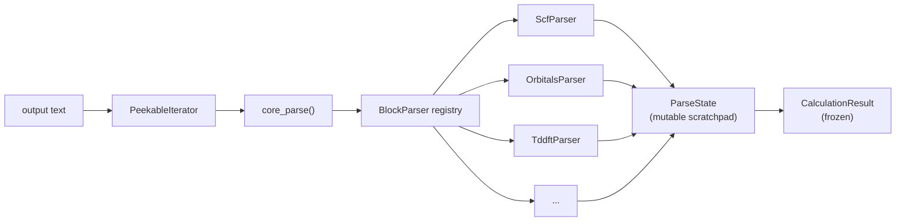

# Concepts

CalcFlow is built around three ideas: *immutability*, *composition*, and *separation of concerns*. Understanding these makes the API feel inevitable rather than arbitrary.

!!! abstract "Core idea"
    **A quantum chemistry result is a fact, not a variable.** Once a calculation has run, its output is fixed. CalcFlow models this directly: every parsed result and every calculation spec is a frozen, immutable object. You don't update results — you derive new ones.

## Immutable Data Models

All data models in CalcFlow are standard-library `dataclasses` with `frozen=True`. This means:

- **No mutation**: once created, no field can be changed.
- **Hashable and safe**: immutable objects can be used as dict keys, stored in sets, passed across threads without copying.
- **Explicit derivation**: to "change" a spec, you call a setter that returns a *new* instance via `dataclasses.replace()`.

```python
calc = CalculationInput(charge=0, spin_multiplicity=1, task="energy",
                        level_of_theory="B3LYP", basis_set="def2-SVP")

# This does NOT modify calc — it returns a new object
calc_tddft = calc.set_tddft(nroots=5, singlets=True, triplets=False)

assert calc.tddft is None        # original unchanged
assert calc_tddft.tddft is not None
```

This design makes it trivial to branch a spec:

```python
base = CalculationInput(charge=0, spin_multiplicity=1, task="energy",
                        level_of_theory="wB97X-D3", basis_set="def2-TZVP")

in_vacuum  = base
in_solvent = base.set_solvation(model="smd", solvent="water")
with_tddft = base.set_tddft(nroots=10, singlets=True, triplets=False)
```

All three objects share the same immutable base — there's no risk of one accidentally mutating another's settings.

## The Parser Architecture

Parsing a quantum chemistry output file is not a monolithic task. An output file is a sequence of *blocks* — each block has a distinctive header line, a specific format, and a well-defined set of data it contributes to the result.

CalcFlow uses the **strategy pattern** to model this.



### The three actors

1. **`core_parse()`** — the engine. It iterates over lines using a `PeekableIterator`, and for each line, asks every registered `BlockParser` whether it handles that line.

2. **`BlockParser`** — a protocol with two methods:
    - `matches(line, state) -> bool` — a fast, stateless check. Does this parser handle this line? Must also check completion flags to avoid parsing the same block twice.
    - `parse(iterator, start_line, state) -> None` — called when `matches` returns `True`. Consumes lines from the iterator and writes results into `state`.

3. **`ParseState`** — the single mutable scratchpad that all parsers write into. When parsing is complete, it's converted to an immutable `CalculationResult`.

### Why this matters

Adding support for a new output block — say, a new charge method or a new excited-state property — requires writing one new `BlockParser` class and registering it. Nothing else changes. The core engine, the state object, and every other parser are untouched.

See [Writing Block Parsers](developers/parsers.md) for the full recipe.

## The Fluent Input API

`CalculationInput` is CalcFlow's answer to the question: *how do you specify a quantum chemistry calculation without learning program-specific keywords?*

The answer is a composable, self-validating Python object. You describe *what* you want — method, basis, task, solvation, excited states — and the program-specific builders translate that spec into valid input syntax.

```python
calc = (
    CalculationInput(
        charge=0,
        spin_multiplicity=1,
        task="geometry",
        level_of_theory="PBE0",
        basis_set="def2-TZVP",
    )
    .set_optimization(calc_hess_initial=True)
    .run_frequency_after_opt()
    .set_solvation(model="cpcm", solvent="acetonitrile")
    .set_cores(16)
)

qchem = calc.export("qchem", geom)
orca  = calc.export("orca", geom)
```

Validation happens at construction time — not at export time. If you pass incompatible settings (e.g. MOM without `unrestricted=True`), you get an error immediately, not when the job is submitted.

## Zero Dependencies

The core `calcflow` package has **no runtime dependencies**. No numpy, no pandas, no pydantic. This is a deliberate constraint.

The rationale: a library for I/O should be installable in any environment, including minimal HPC environments, CI containers, and scripts that run alongside QC programs. A hard numpy dependency would break this.

The `postprocess` module (spectrum broadening) requires numpy, but it's gated behind an optional extra:

```bash
pip install "calcflow[numpy]"
```

## Self-Documenting API

CalcFlow is designed to be usable by LLMs and by users who haven't read the full documentation. Both `CalculationInput` and `CalculationResult` expose a runtime API reference generated from the source code:

```python
# Full setter catalogue with signatures and docstrings
print(CalculationInput.get_api_docs())

# Structural field map with types and units
from calcflow.common.results import CalculationResult
print(CalculationResult.get_api_docs())
```

These methods use introspection — they always reflect the actual current state of the code, not a separately maintained documentation string.

## Schema Versioning

Serialized `CalculationInput` and `CalculationResult` objects include two version fields:

- **`calcflow_version`** — the semver string of the package that produced the dump. For provenance only.
- **`schema_version`** — an integer that tracks structural compatibility. This is the one that drives migration logic.

When you call `CalculationResult.from_dict(data)`, CalcFlow checks `data["schema_version"]` and runs sequential migration steps to bring old dumps up to the current schema. This means a result serialized two versions ago is still loadable today.

See [Schema Versioning](developers/schema-versioning.md) for the full rules on when to bump and how to write migrations.
