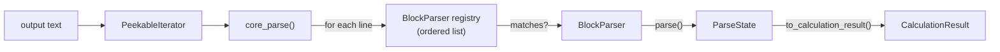

# Writing Block Parsers

CalcFlow's parser architecture is designed to be surgical: adding support for a new output block requires writing one new class and registering it. Nothing else changes.

## Architecture Overview



The three actors:

1. **`core_parse(text, registry)`** — iterates lines, checks each against the registry, dispatches to the first matching parser.
2. **`BlockParser`** — a protocol with two methods: `matches()` and `parse()`.
3. **`ParseState`** — a single mutable scratchpad; converted to a frozen `CalculationResult` when parsing is complete.

## The BlockParser Protocol

```python
from calcflow.io.core import BlockParser
from calcflow.io.peekable import PeekableIterator
from calcflow.io.state import ParseState

class MyParser:
    def matches(self, line: str, state: ParseState) -> bool:
        ...

    def parse(self, iterator: PeekableIterator, start_line: str, state: ParseState) -> None:
        ...
```

### `matches(line, state) -> bool`

- **Must be fast** — called on every line.
- **Must not mutate state** — side effects in `matches()` will cause subtle bugs.
- **Must check completion flags** — if your parser sets `state.parsed_scf = True`, check that flag first to avoid parsing the same block twice.

```python
def matches(self, line: str, state: ParseState) -> bool:
    return not state.parsed_mulliken and "Mulliken charges:" in line
```

### `parse(iterator, start_line, state) -> None`

- Receives the `PeekableIterator` positioned *after* the matching line was consumed.
- `start_line` is the line that matched — useful if it contains data you need.
- Consumes lines from the iterator and writes results into `state`.
- **Must set its completion flag** at the end (e.g. `state.parsed_mulliken = True`).
- **Must use `iterator.push_back(line)` if it reads past the block end** — never buffer lines in state.

## PeekableIterator

`PeekableIterator` wraps a line iterator with look-ahead and push-back:

```python
from calcflow.io.peekable import PeekableIterator

# peek at the next line without consuming it
line = iterator.peek()

# push a line back (use when you've over-read)
iterator.push_back(line)

# consume lines while a condition holds
lines = iterator.take_while(lambda l: l.strip() != "")

# consume lines until a sentinel is found (sentinel is NOT consumed)
lines = iterator.take_until(lambda l: "END" in l)

# skip N lines
iterator.skip(2)
```

### The over-reading pattern

Some blocks end when a new block begins, meaning you detect the end by reading the first line of the *next* block. Push that line back so the core engine can dispatch it:

```python
def parse(self, iterator, start_line, state):
    for line in iterator:
        if self._is_end_sentinel(line):
            iterator.push_back(line)  # let the engine handle this line
            break
        # process line...
    state.parsed_this_block = True
```

## ParseState

`ParseState` (`calcflow/io/state.py`) is the mutable scratchpad during parsing. It has:

- **Result fields**: `final_energy`, `scf`, `orbitals`, `tddft`, etc. — written by parsers.
- **Control flags**: `parsed_scf`, `parsed_tddft_tda`, `parsed_mulliken`, etc. — set by parsers to prevent duplicate parsing, checked in `matches()`.
- **`to_calculation_result()`** — converts the mutable state to a frozen `CalculationResult`.

Look at the existing `ParseState` fields before adding new ones to understand the established naming conventions.

## Step-by-Step: Adding a New Parser

### 1. Identify the block markers

Find the distinctive start and end lines in the output file. Look for:

- A unique header string that only appears once per calculation
- Whether the block ends with a blank line, a specific sentinel, or a new block header

### 2. Create a model in `common/models.py`

```python
# calcflow/common/models.py
from dataclasses import dataclass
from calcflow.common.models import FrozenModel

@dataclass(frozen=True)
class MyNewResult(FrozenModel):
    value: float
    unit: str
```

If the result belongs on `CalculationResult`, add it as a field there too.

### 3. Add a field and flag to `ParseState`

```python
# calcflow/io/state.py
class ParseState:
    # ... existing fields ...
    my_new_result: MyNewResult | None = None
    parsed_my_new_block: bool = False
```

### 4. Implement the BlockParser

Create a new file (e.g. `calcflow/io/qchem/blocks/my_block.py`):

```python
from calcflow.io.core import BlockParser
from calcflow.io.peekable import PeekableIterator
from calcflow.io.state import ParseState
from calcflow.common.models import MyNewResult
from calcflow.common.exceptions import ParsingError


class MyBlockParser:
    def matches(self, line: str, state: ParseState) -> bool:
        return not state.parsed_my_new_block and "My Block Header" in line

    def parse(self, iterator: PeekableIterator, start_line: str, state: ParseState) -> None:
        value = None
        for line in iterator:
            if not line.strip():
                break  # blank line ends the block
            if "Value:" in line:
                try:
                    value = float(line.split()[-1])
                except ValueError as e:
                    raise ParsingError(f"Could not parse value: {line!r}") from e

        if value is None:
            raise ParsingError("My block was matched but no value was found")

        state.my_new_result = MyNewResult(value=value, unit="Hartree")
        state.parsed_my_new_block = True
```

### 5. Register the parser

Add an instance to the parser registry in the program's `parser.py`:

```python
# calcflow/io/qchem/parser.py
from calcflow.io.qchem.blocks.my_block import MyBlockParser

PARSER_REGISTRY = [
    # ... existing parsers ...
    MyBlockParser(),
]
```

**Order matters.** Place parsers earlier in the list if they need to run before others. In practice, termination and metadata parsers go last; block-specific parsers go roughly in the order the blocks appear in the output.

### 6. Wire the result into `to_calculation_result()`

In `ParseState.to_calculation_result()`, include the new field:

```python
return CalculationResult(
    # ... existing fields ...
    my_new_result=self.my_new_result,
)
```

And add the corresponding field to `CalculationResult` in `calcflow/common/results.py`.

### 7. Write a contract test

A contract test verifies that the parser produces the correct *structure* from a minimal fixture — not numerical precision, just field presence and types:

```python
# tests/io/qchem/qchem_parsers/test_qchem_my_block.py
import pytest
from calcflow import parse_qchem_output

FIXTURE = """\
 My Block Header
   Value:   -1.234567890
 
"""

@pytest.mark.contract
def test_my_block_parses_value():
    result = parse_qchem_output(FIXTURE)
    assert result.my_new_result is not None
    assert isinstance(result.my_new_result.value, float)

@pytest.mark.contract
def test_my_block_value_is_negative():
    result = parse_qchem_output(FIXTURE)
    assert result.my_new_result.value < 0
```

Keep the fixture minimal — just enough lines to trigger the parser and provide the data it needs.

## Worked Example: MullikenChargesParser

The Mulliken parser in `calcflow/io/qchem/blocks/charges.py` illustrates the standard pattern:

```python
class MullikenParser:
    def matches(self, line: str, state: ParseState) -> bool:
        return not state.parsed_mulliken and "Mulliken charges:" in line  # (1)!

    def parse(self, iterator: PeekableIterator, start_line: str, state: ParseState) -> None:
        charges: dict[int, float] = {}
        spins:   dict[int, float] = {}

        # skip the "  Atom  Charge  Spin" header line
        next(iterator)

        for line in iterator.take_until(lambda l: "Sum of Mulliken charges" in l):  # (2)!
            parts = line.split()
            if len(parts) >= 3:
                atom_idx = int(parts[0]) - 1  # convert to 0-based  # (3)!
                charges[atom_idx] = float(parts[2])
                if len(parts) >= 4:
                    spins[atom_idx] = float(parts[3])

        state.atomic_charges.append(
            AtomicCharges(method="Mulliken", charges=charges, spins=spins or None)
        )
        state.parsed_mulliken = True  # (4)!
```

1. Guard with `not state.parsed_mulliken` — prevents re-parsing if the block appears multiple times.
2. `take_until` consumes lines up to (but not including) the summary line, so the summary line remains in the iterator.
3. Q-Chem uses 1-based atom numbering — always subtract 1 when writing to state.
4. Set the completion flag unconditionally, even if no charges were found — this prevents infinite loops.

## Common Pitfalls

- **Forgetting the completion flag**: the parser will re-run every time it sees the header line.
- **Mutating state in `matches()`**: creates order-dependent bugs that are hard to track down.
- **Not pushing back over-read lines**: the next block's header will be silently swallowed.
- **Using `buffered_line` on state**: the correct mechanism is `iterator.push_back()`. The state object has no `buffered_line` field.
- **Raising bare `Exception`**: always raise `ParsingError` from `calcflow.common.exceptions` so callers can catch CalcFlow-specific errors.
